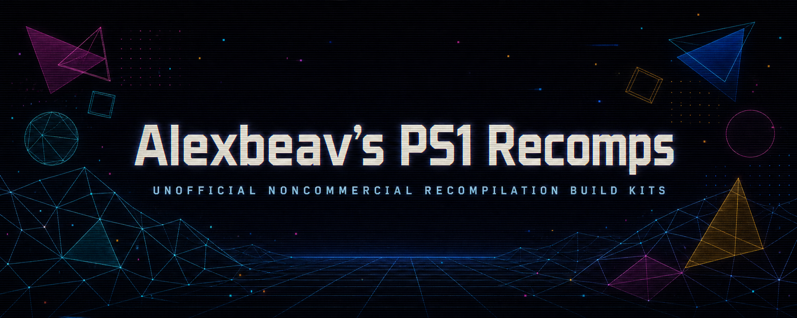

  

# PSXRecomp Ports

Unofficial, noncommercial PlayStation recompilation releases for Windows.

These are deliberately **bare recompilations**. They do not include per-game
enhancements: no widescreen patches, replacement renderers, texture packs,
mouselook, wheel/HOTAS support, or similar showcase work. They provide the
original game through the standard facilities already supplied by PSXRecomp.

Performance has **not** been formally profiled. No minimum specification,
locked-frame-rate, or laptop-performance claim is being made yet.

## What you supply

Each download is an **owned-input build kit**, not a playable executable. The
kit contains no disc data, retail BIOS, generated game code, generated retail-
BIOS code, or prebuilt title executable. You provide dumps of the matching
original disc and retail BIOS from material you own; the kit verifies both and
generates the title on your PC. OpenBIOS is neither included nor accepted.

1. Download and extract one kit to a normal writable folder such as
   `Documents\PSXRecomp` (not `Program Files`).
2. Double-click `SETUP.bat` and select Disc 1's CUE plus the requested BIOS.
3. Wait while the hash-pinned tools are downloaded and the executable is built
   locally. The first setup can take several minutes.
4. Run `PLAY.bat`. In the launcher, assign keyboard or a detected gamepad to
   each visible player card, then choose **Play**.

Windows may display an **Unknown publisher** SmartScreen warning for the locally
built executable. After verifying the download, choose **More info → Run
anyway** if you wish to continue. To verify a kit manually, run
`certutil -hashfile <download.zip> SHA256` and compare it with the adjacent
`.sha256` file or the release-wide `SHA256SUMS.txt`.

## v0.2.3 owned-input games

These links point to the owned-input kits in release `v0.2.3`.

`v0.2.3` stages the pinned `libchdr` source before CMake starts. This removes
the undeclared certificate-bundle dependency that blocked setup on clean
Windows 10 and Windows 11 systems.

`v0.2.1` was withdrawn after a clean-machine run exposed failures when a kit
was extracted below a Windows path containing spaces. `v0.2.2` relocates the
pinned compiler to a shared space-free cache, uses reliable ZIP extraction,
and omits the optional embedded Windows icon that triggered the remaining
resource-compiler failure.

<!-- BEGIN GENERATED GAME CATALOG -->
Use the [sortable game catalog](https://alexbeav.github.io/psxrecomp-ports/) to sort by title, region, BIOS, or player count. Select a title there to see screenshots, known issues, and shipped enhancements.

| Title | Region | Supported original | BIOS | Players | Releases |
| --- | --- | --- | --- | ---: | --- |
| [Alien Resurrection](https://alexbeav.github.io/psxrecomp-ports/#alien-resurrection) | Europe | `SLES-02913` | `SCPH-5552` | 1 player | [Windows](https://github.com/Alexbeav/psxrecomp-ports/releases/download/v0.2.3/psxrecomp-alien-resurrection-europe-v0.2.3-owned-input-win64.zip) |
| [Bloody Roar II](https://alexbeav.github.io/psxrecomp-ports/#bloody-roar-ii) | USA | `SCUS-94424` | `SCPH-1001` | 2 players | [Windows](https://github.com/Alexbeav/psxrecomp-ports/releases/download/v0.2.3/psxrecomp-bloody-roar-ii-usa-v0.2.3-owned-input-win64.zip) |
| [Brave Fencer Musashi](https://alexbeav.github.io/psxrecomp-ports/#brave-fencer-musashi) | USA | `SLUS-00726` | `SCPH-1001` | 1 player | [Windows](https://github.com/Alexbeav/psxrecomp-ports/releases/download/v0.2.3/psxrecomp-brave-fencer-musashi-usa-v0.2.3-owned-input-win64.zip) |
| [Diablo](https://alexbeav.github.io/psxrecomp-ports/#diablo) | Europe (Spanish/Portuguese) | `SLES-01156` | `SCPH-5552` | 2 players | [Windows](https://github.com/Alexbeav/psxrecomp-ports/releases/download/v0.2.3/psxrecomp-diablo-europe-v0.2.3-owned-input-win64.zip) |
| [Fighting Force](https://alexbeav.github.io/psxrecomp-ports/#fighting-force) | USA | `SLUS-00433` | `SCPH-1001` | 2 players | [Windows](https://github.com/Alexbeav/psxrecomp-ports/releases/download/v0.2.3/psxrecomp-fighting-force-usa-v0.2.3-owned-input-win64.zip) |
| [Jackie Chan Stuntmaster](https://alexbeav.github.io/psxrecomp-ports/#jackie-chan-stuntmaster) | USA | `SLUS-00684` | `SCPH-1001` | 1 player | [Windows](https://github.com/Alexbeav/psxrecomp-ports/releases/download/v0.2.3/psxrecomp-jackie-chan-stuntmaster-usa-v0.2.3-owned-input-win64.zip) |
| [Legacy of Kain: Soul Reaver](https://alexbeav.github.io/psxrecomp-ports/#legacy-of-kain-soul-reaver) | Europe | `SLES-01301` | `SCPH-5552` | 1 player | [Windows](https://github.com/Alexbeav/psxrecomp-ports/releases/download/v0.2.3/psxrecomp-legacy-of-kain-soul-reaver-europe-v0.2.3-owned-input-win64.zip) |
| [MDK](https://alexbeav.github.io/psxrecomp-ports/#mdk) | Europe | `SLES-00599` | `SCPH-5552` | 1 player | [Windows](https://github.com/Alexbeav/psxrecomp-ports/releases/download/v0.2.3/psxrecomp-mdk-europe-v0.2.3-owned-input-win64.zip) |
| [MediEvil](https://alexbeav.github.io/psxrecomp-ports/#medievil) | USA | `SCUS-94227` | `SCPH-1001` | 1 player | [Windows](https://github.com/Alexbeav/psxrecomp-ports/releases/download/v0.2.3/psxrecomp-medievil-usa-v0.2.3-owned-input-win64.zip) |
| [MediEvil II](https://alexbeav.github.io/psxrecomp-ports/#medievil-ii) | USA | `SCUS-94564` | `SCPH-1001` | 1 player | [Windows](https://github.com/Alexbeav/psxrecomp-ports/releases/download/v0.2.3/psxrecomp-medievil-ii-usa-v0.2.3-owned-input-win64.zip) |
| [Metal Slug X](https://alexbeav.github.io/psxrecomp-ports/#metal-slug-x) | USA | `SLUS-01212` | `SCPH-1001` | 2 players | [Windows](https://github.com/Alexbeav/psxrecomp-ports/releases/download/v0.2.3/psxrecomp-metal-slug-x-usa-v0.2.3-owned-input-win64.zip) |
| [Monster Rancher 2](https://alexbeav.github.io/psxrecomp-ports/#monster-rancher-2) | USA | `SLUS-00917` | `SCPH-1001` | 2 players | [Windows](https://github.com/Alexbeav/psxrecomp-ports/releases/download/v0.2.3/psxrecomp-monster-rancher-2-usa-v0.2.3-owned-input-win64.zip) |
| [Mortal Kombat 4](https://alexbeav.github.io/psxrecomp-ports/#mortal-kombat-4) | USA | `SLUS-00605` | `SCPH-1001` | 2 players | [Windows](https://github.com/Alexbeav/psxrecomp-ports/releases/download/v0.2.3/psxrecomp-mortal-kombat-4-usa-v0.2.3-owned-input-win64.zip) |
| [Nightmare Creatures](https://alexbeav.github.io/psxrecomp-ports/#nightmare-creatures) | USA | `SLUS-00582` | `SCPH-1001` | 1 player | [Windows](https://github.com/Alexbeav/psxrecomp-ports/releases/download/v0.2.3/psxrecomp-nightmare-creatures-usa-v0.2.3-owned-input-win64.zip) |
| [Oddworld: Abe's Oddysee](https://alexbeav.github.io/psxrecomp-ports/#oddworld-abe-s-oddysee) | USA | `SLUS-00190` | `SCPH-1001` | 1 player | [Windows](https://github.com/Alexbeav/psxrecomp-ports/releases/download/v0.2.3/psxrecomp-oddworld-abe-s-oddysee-usa-v0.2.3-owned-input-win64.zip) |
| [Quake II](https://alexbeav.github.io/psxrecomp-ports/#quake-ii) | USA | `SLUS-00757` | `SCPH-1001` | Up to 4 players | [Windows](https://github.com/Alexbeav/psxrecomp-ports/releases/download/v0.2.3/psxrecomp-quake-ii-usa-v0.2.3-owned-input-win64.zip) |
| [Spyro the Dragon](https://alexbeav.github.io/psxrecomp-ports/#spyro-the-dragon) | Europe | `SCES-01438` | `SCPH-5552` | 1 player | [Windows](https://github.com/Alexbeav/psxrecomp-ports/releases/download/v0.2.3/psxrecomp-spyro-the-dragon-europe-v0.2.3-owned-input-win64.zip) |
| [Syphon Filter 3](https://alexbeav.github.io/psxrecomp-ports/#syphon-filter-3) | USA | `SCUS-94640` | `SCPH-1001` | 2 players | [Windows](https://github.com/Alexbeav/psxrecomp-ports/releases/download/v0.2.3/psxrecomp-syphon-filter-3-usa-v0.2.3-owned-input-win64.zip) |
| [Tenchu: Stealth Assassins](https://alexbeav.github.io/psxrecomp-ports/#tenchu-stealth-assassins) | USA | `SLUS-00706` | `SCPH-1001` | 1 player | [Windows](https://github.com/Alexbeav/psxrecomp-ports/releases/download/v0.2.3/psxrecomp-tenchu-stealth-assassins-usa-v0.2.3-owned-input-win64.zip) |
| [Tony Hawk's Pro Skater](https://alexbeav.github.io/psxrecomp-ports/#tony-hawks-pro-skater) | USA | `SLUS-00860` | `SCPH-1001` | 2 players | [Windows](https://github.com/Alexbeav/psxrecomp-ports/releases/download/v0.2.3/psxrecomp-tony-hawk-s-pro-skater-usa-v0.2.3-owned-input-win64.zip) |
| [Tony Hawk's Pro Skater 2](https://alexbeav.github.io/psxrecomp-ports/#tony-hawk-s-pro-skater-2) | USA | `SLUS-01066` | `SCPH-1001` | 2 players | [Windows](https://github.com/Alexbeav/psxrecomp-ports/releases/download/v0.2.3/psxrecomp-tony-hawk-s-pro-skater-2-usa-v0.2.3-owned-input-win64.zip) |
| [Tony Hawk's Pro Skater 3](https://alexbeav.github.io/psxrecomp-ports/#tony-hawk-s-pro-skater-3) | USA | `SLUS-01419` | `SCPH-1001` | 2 players | [Windows](https://github.com/Alexbeav/psxrecomp-ports/releases/download/v0.2.3/psxrecomp-tony-hawk-s-pro-skater-3-usa-v0.2.3-owned-input-win64.zip) |
| [Tony Hawk's Pro Skater 4](https://alexbeav.github.io/psxrecomp-ports/#tony-hawk-s-pro-skater-4) | USA | `SLUS-01485` | `SCPH-1001` | 2 players | [Windows](https://github.com/Alexbeav/psxrecomp-ports/releases/download/v0.2.3/psxrecomp-tony-hawk-s-pro-skater-4-usa-v0.2.3-owned-input-win64.zip) |
| [Valkyrie Profile](https://alexbeav.github.io/psxrecomp-ports/#valkyrie-profile) | USA | `SLUS-01156 · 2 discs` | `SCPH-1001` | 1 player | [Windows](https://github.com/Alexbeav/psxrecomp-ports/releases/download/v0.2.3/psxrecomp-valkyrie-profile-usa-v0.2.3-owned-input-win64.zip) |
| [WipEout](https://alexbeav.github.io/psxrecomp-ports/#wipeout) | Europe | `SCES-00010` | `SCPH-5552` | 1 player | [Windows](https://github.com/Alexbeav/psxrecomp-ports/releases/download/v0.2.3/psxrecomp-wipeout-europe-v0.2.3-owned-input-win64.zip) |
| [Xena: Warrior Princess](https://alexbeav.github.io/psxrecomp-ports/#xena-warrior-princess) | USA | `SLUS-00977` | `SCPH-1001` | 1 player | [Windows](https://github.com/Alexbeav/psxrecomp-ports/releases/download/v0.2.3/psxrecomp-xena-warrior-princess-usa-v0.2.3-owned-input-win64.zip) |
<!-- END GENERATED GAME CATALOG -->

Colin McRae Rally 2.0 was removed from this wave after operator testing found
major graphical issues. Nightmare Creatures takes its place. It was not silently
published as a passing title.

## Standard PSXRecomp features

Press **F1** in game for fullscreen/window modes, presentation and texture
filtering, persistent volume, controller-port routing, session-only **Change
disc**, **Reinsert current disc**, and controller/keyboard navigation.

Multiplayer packages expose separate player cards in the launcher. Keyboard and
gamepads can be assigned independently, including keyboard + controller. The F1
controller-port option swaps existing host assignments between PlayStation ports;
it does not select physical devices.

## Release-wide limitations

- **F1 → Display → Window Scale does not work reliably.** Window Scale is
  separate from internal rendering resolution and does not control
  supersampling. Close the game and use the pre-launch GUI to change
  supersampling.
- Local multiplayer metadata is included, but representative Player 2 testing
  remains unqualified.
- Most titles have an automated startup-survival pass, not an end-to-end game
  completion claim. Read each package's `COMPATIBILITY.md`.
- Performance has not been profiled across representative desktop and laptop
  hardware.
- Locally built executables are not digitally signed and may trigger Windows
  SmartScreen.
- `setup.log`, `settings.toml`, and runtime report JSON files can contain local
  filesystem paths. Redact them before attaching them to a public issue.

## Contributing

Anyone may fork this repository and study or experiment with the build kits for
noncommercial purposes, subject to this repository's PolyForm Noncommercial
License 1.0.0, PSXRecomp's license, and the rights applicable to each original
game. Contributions and reproducible compatibility reports are welcome.

Report problems through **Issues** using this title format:

`[Game Name][Issue] Short description`

For example: `[Alien Resurrection][Issue] Intro FMV displays a corrupted band`.

Include the release version, game region/serial, point reached in gameplay,
reproduction steps, expected behavior, and observed behavior. Do not upload
game media, BIOS files, generated game or BIOS code, locally built executables,
memory cards, save states, or unredacted local paths.

## About this project

These ports are developed by a hobbyist (a DevSecOps engineer, not a game
programmer) with substantial AI assistance. What keeps that honest: every
change is validated before it ships - boot gates, hardware-oracle A/B
comparisons (Beetle/DuckStation), deterministic replay probes, and a shared
findings registry that documents failures as carefully as successes. AI
writes most of the code; the evidence discipline decides what survives.
Bug reports welcome - expect them to be investigated the same way.

tl;dr AI writes the code, but I always test it myself before pushing

These projects are powered by
[`psxrecomp`](https://github.com/mstan/psxrecomp), licensed under the PolyForm
Noncommercial License 1.0.0. Game names identify compatibility targets only.
This project is not affiliated with or endorsed by Sony Interactive
Entertainment or any game publisher or developer.
